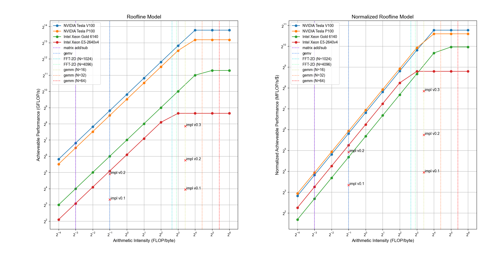

Roofline.py
===========

This is a simple script to plot the [Roofline model](https://dl.acm.org/citation.cfm?id=1498785) of
given HW platforms and given applications.
The script can take its input from:
1. `stdin`: In this case, it reads first the HW characteristics followed by a `EOF`.
   Then, you will be prompted to enter the applications' intensities followed by an `EOF`.
2. files: In this case, it reads two comma-separated values (CSV) files; one for HW and the other
   for the applications.

In addition, it supports plotting different implementations per application. In
this case, the different implementations are provided as pairs of `name, throughput_in_gflops` after
the application intensity (i.e., additional values in the csv file). For an
example, see `apps.csv`.

Requirements
------------
You need:
* Python 3.6 or higher with: `numpy` and `matplotlib`. Tested with Python 3.6 and 3.11

Screenshot
----------

License
-------
BSD license shown in LICENSE
